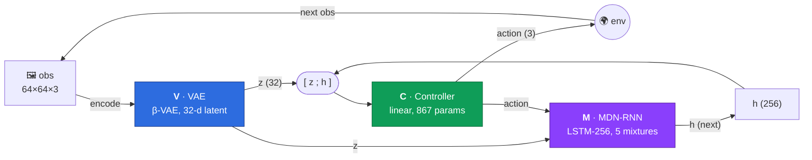
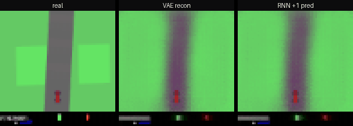

<div align="center">

# 🏎️ World Models — CarRacing reproduction

**A faithful reproduction of Ha & Schmidhuber's [*World Models*](https://arxiv.org/abs/1803.10122) on `CarRacing-v3`.**

Learn a compact latent of pixels (**V**), dream the dynamics of that latent (**M**),
then evolve a tiny linear controller (**C**) that drives from `[z; h]` alone.

[](https://arxiv.org/abs/1803.10122)
[](https://huggingface.co/collections/flydexo/world-models-6a493823e48400161b1cd828)
[](https://gymnasium.farama.org/environments/box2d/car_racing/)

### 🎯 Result: **915.9** best-agent reward &nbsp;·&nbsp; paper target **906 ± 21**

</div>

---

## Architecture

The World Model factorises an agent into three parts. Only the **Controller** touches the
reward — the vision and memory modules are trained once, self-supervised, and then frozen.



| Module | Role | Design | Training |
|---|---|---|---|
| **V** — VAE (`model.AutoEncoder`) | Compress each frame into a 32-d latent `z` | 4× stride-2 conv `[32→64→128→256]` encoder, mirror deconv decoder, sigmoid output. β-VAE with a **free-bits** KL floor. | Reconstruction (sum-SSE) + KL, per-frame, self-supervised |
| **M** — MDN-RNN (`model.RNN`) | Predict the *next* latent `p(z′ \| z, a, h)` | LSTM (hidden 256) over `[z; a]` (35-d), **Mixture-Density** head: 5 Gaussians × 32 dims | Mixture NLL on sampled `z ~ N(μ, σ)`, 20 epochs |
| **C** — Controller (`Controller`) | Map state to action | Single linear layer `[z(32); h(256)] → a(3)`, **867 parameters** | **CMA-ES** in the real env (V, M frozen) |

---

## Dataset

Rollouts are collected with a **correlated random policy** — i.i.d. sampling at 50 Hz averages
to zero net steering, so the car never sees corners at speed. Instead each action is *held* for
1–8 frames and the brake is touched only ~10 % of the time.

- **Environment:** `CarRacing-v3` (Gymnasium, continuous), frames resized to **64×64×3**
- **Volume:** **1,030 episodes** × up to 1,000 steps ≈ **1M frames**
- **Storage:** [LanceDB](https://lancedb.com/) columnar table, streamed to training with a shuffle buffer
- **Speed:** batched collection via **EnvPool** (`4 × cpu_count` lanes) when available, with a `gym.make_vec` fallback

```bash
uv run python collect_dataset.py           # → db/ (LanceDB "episodes" table)
```

---

## Ablations — taming posterior collapse in **V**

The single most important knob for the whole pipeline is the VAE's **free-bits floor** `λ`
(the minimum KL, in nats, allocated *per latent dimension*). Too low and the decoder ignores
most latents — **dead dimensions** the RNN and controller can never use. The sweep below
(β = 1.0, 1k episodes) shows the transition, and pins the paper-matched setting.

| `λ` (nats/dim) | val recon ↓ | val KL | **dead dims** | active dims |
|:---:|:---:|:---:|:---:|:---:|
| 0.125 | 37.5 | 7.6 | 🔴 **62.5 %** | 12 / 32 |
| 0.25 | 40.2 | 8.8 | 🟠 25 % | 24 / 32 |
| **0.5** ⭐ | 40.7 | 16.0 | 🟢 **0 %** | **32 / 32** |
| 1.0 | 39.7 | 31.9 | 🟢 0 % | 32 / 32 |
| 2.0 | 41.2 | 61.1 | 🟢 0 % | 32 / 32 |

⭐ **`λ = 0.5` (16 nats total)** is the sweet spot — the smallest floor that keeps **all 32
dimensions alive** — and matches Ha's `kl_tolerance = 0.5 × 32`. The full grid also sweeps
`β ∈ {0.5, 1.0, 2.0}` and 1k vs 10k episodes; explore it live below.

### 📊 Live dashboard — VAE free-bits sweep

<div align="center">
<a href="https://huggingface.co/spaces/flydexo/ha_schmidhuber-vae">

</a>
</div>

<iframe
  src="https://flydexo-ha-schmidhuber-vae.hf.space/?project=ha_schmidhuber-vae&run_ids=8f90f0a320194673b98026661ccc276a,e6402991a05248778d4ab717631cfe0d,04fd87d72cb74193a29f896dd15489ab,a3ae9e4be9d14126940da9daaf348d12,b47dca87c5924ea9944a1b9027b32d9f&metric_filter=frac_dead%7Cactive_dims%7Cval-recon%7Cval-kl&sidebar=collapsed"
  width="100%" height="640" frameborder="0"></iframe>

> Filtered to the **β = 1.0 free-bits sweep** (`λ = 0.125 → 2`). Watch `posterior/frac_dead`
> collapse to zero and `posterior/active_dims` climb to 32 as `λ` grows.

---

## Memory — training **M**

The MDN-RNN is trained on `z` **sampled** from the VAE posterior each step (paper App. A.2),
predicting the next latent as a 5-component Gaussian mixture. 20 epochs, mixture NLL:
train loss **42.8 → 28.3**, val **31.7 → 28.3**.

### 📊 Live dashboard — MDN-RNN training

<iframe
  src="https://flydexo-ha-schmidhuber.hf.space/?project=ha_schmidhuber&run_ids=e23d9c1fd8a1431b8331fec9a5c4a23d&metric_filter=rnn&sidebar=collapsed"
  width="100%" height="520" frameborder="0"></iframe>

<div align="center">
<a href="https://huggingface.co/spaces/flydexo/ha_schmidhuber">

</a>
</div>

---

## Score — evolving **C** with CMA-ES

The controller is a single 867-parameter linear map, evolved with **CMA-ES** directly in the
real environment (V and M frozen). Each candidate is scored as the mean reward over **16
rollouts** of 1,000 steps; the population is **64**. EnvPool batches the whole population
through one C++ vector env, with V/M shared on the GPU and the per-candidate controller as a `bmm`.

<div align="center">

| Metric | This run | Paper (Ha & Schmidhuber) |
|---|:---:|:---:|
| **Best agent** | **915.9** | — |
| Best-of-generation (mean, last 50 gens) | ~908 | — |
| Population mean (plateau) | ~747 | ~850–870 |
| **Final reported** | **915.9** | **906 ± 21** |
| Generations to peak | 146 | 1800 |

**≈ 100 % of the paper's target reproduced** — the best CarRacing agent crosses the 900-line
that defines "solved."

</div>

### 🎥 The full loop, live

<div align="center">

<br/>
<sub><b>left:</b> what the car sees &nbsp;·&nbsp; <b>middle:</b> the frame round-tripped through <b>V</b> (VAE) &nbsp;·&nbsp; <b>right:</b> the next frame as <b>M</b> (MDN-RNN) predicts it, one step ahead</sub>
</div>

An episode driven by `controller-controller-2` (V = `vae.pt`, M = `rnn-rnn{epochs=20,episodes=1k}`).
The middle panel shows the β-VAE's lossy-but-faithful reconstruction of each frame; the right panel
is the MDN-RNN's *teacher-forced* prediction of the **next** latent, decoded through the same VAE —
the memory module imagining one frame into the future.

### 📊 Live dashboard — CMA-ES reward curves

<iframe
  src="https://flydexo-ha-schmidhuber.hf.space/?project=ha_schmidhuber&run_ids=c61bd3f562664f0db4e09e4d74391890&metric_filter=reward&sidebar=collapsed"
  width="100%" height="560" frameborder="0"></iframe>

> `reward/best_ever` climbs to **915.9**; `reward/gen_best` settles around 908 while the noisy
> `reward/mean` plateaus near 747 — the CMA-ES signature of a converged elite.

---

## Reproduction notes

The gap between a naïve implementation (~600) and the paper (~906) came down to a handful of
details, all now in place:

- **VAE:** sum-reduced reconstruction paired with a **free-bits** KL floor (`λ = 0.5`/dim), with the KL scaled consistently against the recon term — no posterior collapse.
- **MDN-RNN:** train on `z ~ N(μ, σ)` **sampled** every batch (not the mean `μ`); softmax temperature applied **only at sampling**, never inside the training loss; correct mixture sampling (draw a component, then sample it).
- **Controller:** input is `[z; h]` (latent **plus** the RNN hidden state), matching the paper.
- **CMA-ES:** population **64**, **16** rollouts averaged per candidate, σ = 0.3 — enough signal to escape the noise-dominated regime a small population gets stuck in.

## Repository layout

| File | What it does |
|---|---|
| `collect_dataset.py` | Correlated-random rollout collection → LanceDB |
| `model.py` | `AutoEncoder` (V), `RNN` + `MDN` (M) |
| `train_vae.py` / `train_rnn.py` | Self-supervised training of V and M |
| `vae-ablations.py` | Hydra multirun grid over β / free-bits / λ |
| `train_controller.py` | CMA-ES controller (EnvPool, worker-pool, and dream backends) |
| `conf/` | Hydra config (`profile/full.yaml`, `profile/smoke.yaml`) |
| `evaluations/` | Reconstruction & driving videos |

```bash
# End-to-end (full profile)
uv run python collect_dataset.py
uv run python train_vae.py training.vae.free_bits=true training.vae.lambda=0.5
uv run python train_rnn.py rnn.vae_path=models/vae-<run>.pt
uv run python train_controller.py \
    controller.vae_path=models/vae-<run>.pt \
    controller.rnn_path=models/rnn-<run>.pt \
    controller.popsize=64 controller.avg=16
```

<div align="center">
<sub>Experiment tracking by <a href="https://github.com/gradio-app/trackio">Trackio</a> ·
Dashboards in the <a href="https://huggingface.co/collections/flydexo/world-models-6a493823e48400161b1cd828">🤗 World Models collection</a></sub>
</div>
